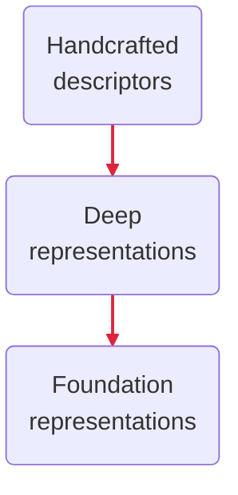

::title::

# Deep Learning for *Image Mining*

::subtitle::

From visual descriptors to foundation representations

::visual::

::footer::

Arturo Mendoza · IPP–Université Paris-Saclay · 2026

  <a class="personal-email" href="mailto:arturo.mendoza.quispe@gmail.com">
    arturo.mendoza.quispe@gmail.com
  </a>
   · 
  <a class="work-email" href="mailto:arturo.mendoza-quispe@safrangroup.com">
    arturo.mendoza-quispe@safrangroup.com
  </a>

<!--
**Purpose:** Set the scope: how learned representations support image mining

**Say:** We will follow how visual representations moved from manually specified features to reusable models that transfer across tasks

**Transition:** Begin with the representation decision shared by every image-mining system
-->
