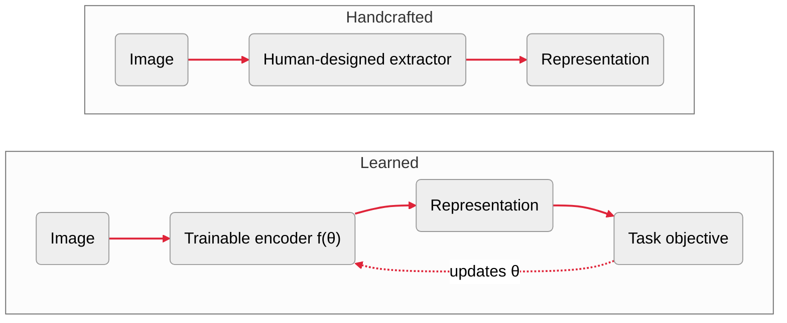

::title::

# Some *reference material*

::text::

- **Deep Learning ⋅** *Goodfellow, Bengio, Courville ⋅ 2015*  
  Best for the fundamentals: neural networks, optimization, backpropagation, loss functions, and the core ideas behind learned representations.

- **Deep Learning for Vision Systems**  
  *Elgendy ⋅ 2020*  
  Very relevant to this course: it connects deep learning to visual understanding, CNNs, feature extraction, transfer learning, and practical vision pipelines.

::visual::

  <figure class="reference-book-card">
    
  </figure>
  <figure class="reference-book-card">
    
  </figure>

---
layout: lesson
ratio: balanced
---

::title::

# One image, *many representations*

::text::

- **Pixels are the starting point**  
  A representation turns an image into a *useful* summary

- **Every summary makes a choice**  
  It keeps some information and leaves the rest out

- **There is no best summary for every question**  
  What is useful depends on what we want to do:
  - **Classification**: name what is present
  - **Segmentation**: locate it in the image
  - **Retrieval**: find images that look similar

> **How do we turn what matters into a useful comparison?**

::visual::

<RepresentationTransform />

<!--
**Purpose:** Introduce representation as selective transformation rather than a task label

**Say:** The middle example is not a final mask. It divides the image into local regions, then describes each region using cues such as color, texture, and edges

**Ask:** If we moved the duck, which summary would survive? Which would change?

**Transition:** Next, connect useful summaries to distance
-->
---
layout: lesson
ratio: balanced
---

::title::

# A representation defines what *close* means

::text::

- **Similarity is a design choice**  
  The representation $f$ decides what information matters; the metric $d$ decides which differences matter

- **These choices shape the neighborhood**  
  They determine which images become close or far apart

- **The task tells us whether that neighborhood is useful**  
  Different tasks need different neighborhoods

  <strong>Example: instance retrieval</strong>
  The same object should remain close across:
  

    crop
    viewpoint
    lighting
  

::visual::

  <EmbeddingPlot />
  

    <MathTex formula="d\left(f(x_{i}), f(x_{j})\right)" />
  

<!--
**Purpose:** Turn the idea of a useful summary into a geometry we can compare

**Say:** This ordering assumes instance retrieval. For category retrieval, different objects of the same type should move closer together

**Ask:** What should move if we change from instance retrieval to category retrieval?

**Transition:** Next, ask how handcrafted methods create this geometry
-->

---
layout: lesson
ratio: balanced
---

::title::

# Building representations *by hand*

::text::

- **Experts design the feature extractor**  
  A method transforms pixels into cues such as edges, gradients, texture, or color

- **They decide which variations should affect the representation**  
  For example: scale, rotation, or illumination

- **They choose how features are organized**  
  As local descriptors or global vectors

- **A handcrafted representation encodes explicit human choices and assumptions**  
  Very effective when those assumptions match the task

::visual::

<figure class="sift-example">
  
  
<strong>SIFT example</strong>local features found and described in two images

  <figcaption>Indif · Wikimedia Commons · CC BY-SA 3.0</figcaption>
</figure>

<!--
**Purpose:** Clarify that handcrafted refers to the design of the extraction method, not to manually choosing every feature value

**Say:** The extractor is fixed by its designer, while the values it produces depend on the image. SIFT is one example of such an extractor

**Ask:** When might rotation carry meaning rather than noise?

**If needed:** A left-pointing arrow must remain different from a right-pointing arrow. Other examples: distinguishing 6 from 9 or checking whether a component is correctly aligned

**Transition:** Next, examine what changes when the representation is learned from data
-->
---
layout: lesson
ratio: stacked
class: slide-comparison-full
---

::title::

# From designed to *learned representations*

::visual::

<!--
**Purpose:** Show what changes when the representation is learned

**Say:** Humans still choose the architecture, data, objective, and constraints. Training tunes the encoder parameters, allowing its internal operations to adapt together

**Ask:** Who now decides which visual information is useful?

**If needed:** Training determines it from the data and objective, within choices still made by humans

**Transition:** Next, identify the human choices that continue to shape the result
-->
---
layout: lesson
ratio: balanced
---

::title::
# We stop designing features, *not making choices*

::text::

- **Data:**  
  Determines which objects, contexts, and visual variations the model can learn from
- **Architecture:**  
  Encodes assumptions about how image information should be processed
- **Objective:**  
  Defines which similarities and differences the representation should preserve
- **These choices constrain one another**

> The result is a learned representation: ${z = f_\theta(x)}$

::visual::

<ChoiceTriangle />

<!--
**Purpose:** Establish that representation learning is shaped by interacting human choices

**Say:** A fine-grained bird classifier needs images showing subtle differences, a model that preserves local detail, and labels that distinguish species. If one choice is mismatched, the representation may discard the information needed for the task

**Ask:** What could happen if one choice is poorly matched to the other two?

**If needed:** The model may optimize the loss while learning shortcuts or representations that transfer poorly

**Transition:** Next, examine what information the resulting representation retains
-->
---
layout: lesson
---

::title::

# Evolution of modern *visual representations*

::text::

This evolution unfolds through three shifts:

1. **Designed → learned features**
   - CNNs and task-driven representation learning

2. **Task-specific → transferable representations**
   - Pretraining, transfer learning, and vision transformers

3. **Narrow supervision → general-purpose pretraining**
   - Self-supervision, multimodal learning, and foundation representations

> Visual representations evolved from hand-designed features to learned representations reused across many tasks

::visual::

<RepresentationEvolution />

<!--
**Purpose:** Give students a map of the three chapters that follow

**Say:** These shifts overlap rather than forming three clean historical periods

**If needed:** The method names are chapter landmarks, not a sequence to memorize

**Transition:** Begin with the first shift and examine how CNNs learn features for a task
-->
