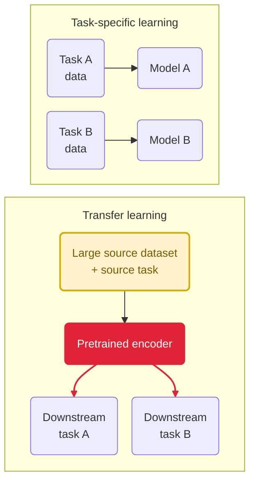
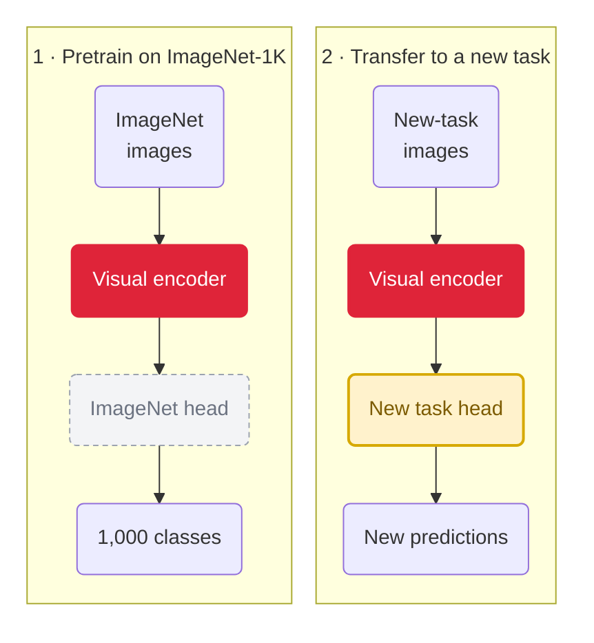

::title::

# Transferable *visual representations*

::question::

How can features learned for one task become useful for another?

<!--
**Purpose:** Shift from examining representations inside their original model to reusing them under new learning conditions

**Say:** The next step is not to discard task-dependent learning. It is to use one learned encoder as the starting point for several downstream problems

**Transition:** First compare the task-specific and transfer workflows directly
-->
---
layout: lesson
---

::title::

# From one model per task to a *reusable representation*

::text::

- **Training from scratch repeats the investment**  
  Each new task needs labeled data, compute, and optimization

- **Transfer separates learning into two stages**  
  A large source dataset trains an encoder once

- **Downstream tasks reuse that encoder**  
  Smaller target datasets adapt it instead of learning every feature from zero

- **The encoder is a starting point, not a guarantee**  
  Its usefulness depends on the downstream task and data

> One large learning investment can support many downstream tasks

::visual::

<!--
**Purpose:** Establish transfer as a change in the learning workflow, not a claim that representations are independent of tasks

**Say:** A model developer performs pretraining by optimizing an encoder for a source task. The result still reflects that source data and objective; it is a learned starting point, not a representation that transfers to everything

**Preview:** Transfer depends on how well the source representation matches the downstream task and domain. We will examine that after the reuse strategies

**Transition:** ImageNet classification became the influential supervised example of how pretraining is performed
-->
---
layout: lesson
ratio: balanced
---

::title::

# The head is task-specific, the *encoder can transfer*

::text::

- **Source task:**  
  Train a classifier on **ImageNet-1K** : about 1.2M training images and 1,000 classes

- **Two model parts:**  
  The encoder learns the representation; the head predicts the ImageNet classes

- **Transfer:**  
  Reuse the pretrained encoder with a custom task-specific head

- **Common pretrained models:**  
  AlexNet, VGG, ResNet, DenseNet

::visual::

Deng et al., 2009 · Krizhevsky et al., 2012 · Simonyan & Zisserman, 2015 · He et al., 2016 · Huang et al., 2017 · Razavian et al., 2014

<!--
**Purpose:** Separate the source-specific classifier from the representation that may be reused

**Say:** ImageNet pretraining performs one task: classification. The head maps features to its 1,000 classes; transfer keeps the encoder and replaces that head

**Examples:** AlexNet, VGG, ResNet, and DenseNet are familiar architectures commonly distributed with ImageNet-1K pretrained weights

**Evidence:** Deng et al. introduced ImageNet; Krizhevsky et al., Simonyan and Zisserman, He et al., and Huang et al. introduced the listed architectures through ImageNet classification; Razavian et al. demonstrated downstream reuse of ImageNet-trained CNN features

**Boundary:** Larger web-scale and self-supervised sources exist; introduce them later with their different data and objectives

**Transition:** Next, keep this encoder fixed and examine what its existing features can already support
-->
---
layout: lesson
ratio: balanced
---

::title::

# Transfer strategies differ by *how much we adapt*

::text::

- **Linear probing**  
    Train a linear head; keep the encoder fixed. Helps evaluate what is linearly accessible.

- **Frozen feature extraction**  
    Train a richer, nonlinear head; keep the encoder fixed.

- **Partial fine-tuning**  
    Update the new head and selected encoder layers.

- **Full fine-tuning**  
    Update the entire model from pretrained—not random—weights.

> All strategies start from pretrained weights; they differ in how much may adapt.

::visual::

  

    
<strong>1 · Linear probe</strong>replace the source head

    

      
Early encoder

      
Middle

      
Upper

      
→

      
Linear head

    

  

  

    
<strong>2 · Partial fine-tuning</strong>unfreeze selected layers

    

      
Early encoder

      
Middle

      
Upper

      
→

      
New head

    

  

  

    
<strong>3 · Full fine-tuning</strong>unfreeze the complete model

    

      
Early encoder

      
Middle

      
Upper

      
→

      
New head

    

  

  

    <i class="legend-swatch frozen"></i>Frozen
    <i class="legend-swatch trainable"></i>Trainable
  

<!--
**Purpose:** Present transfer as a choice about which parameters may learn

**Distinguish:** Replacing the source head defines the downstream predictor; freezing defines which retained layers can change

**Interpret:** A richer head can compensate for a less directly organized feature space, so its accuracy is less diagnostic of representation quality

**Decision cue:** Prefer the least adaptation that reaches the required downstream performance

**Transition:** The best strategy depends on whether source and downstream data require similar visual distinctions
-->
---
layout: comparison
---

::title::

# Transfer depends on *task and domain alignment*

::left::

### 🎯 Task shift

The prediction goal changes

- **Classification → Detection**  
    Name what is present *vs.* locate each object
- **Classification → Segmentation**  
    Label the image *vs.* label every pixel
- **Coarse → Fine classification**  
    Animal category *vs.* individual species

::right::

### 🖼️ Domain shift

The downstream images differ from the pretraining images

- **Content**  
    Everyday objects *vs.* medical tissue
- **Modality**  
    RGB images *vs.* gray-level X-ray images
- **Capture conditions**  
    Frontal *vs.* aerial viewpoint

::takeaway::

> Either mismatch can weaken transfer and require more adaptation.

<!--
**Why it matters:** One encoder may transfer well to one problem and poorly to another.

**Ask:** Did the goal change, the images change, or both?

**Caution:** Visual resemblance does not guarantee statistical alignment.

**Transition:** Source accuracy is not enough; next, we choose how to adapt based on transfer success.
-->
---
layout: lesson
---

::title::

# Transfer works when *representations align*

::text::

- **Why transfer works**  
Pretraining learns generic visual patterns: edges, textures, shapes, objects.  
Encoder discovers hierarchical structure that applies across many vision tasks.

- **How to transfer**  
Different adaptation levels are possible:  
Linear probe → nonlinear head → partial fine-tuning → full fine-tuning.  
Choose based on transfer strength.

- **When transfer works**  
Task shift and domain shift determine success.  
Misalignment weakens transfer. Strong alignment enables reuse.

> A good visual representation can be reused beyond the task used to learn it.

<!--
**Why?** Generic features from pretraining → **When?** Task/domain alignment → **How?** Adapt based on transfer strength.

**One idea:** Value is conditional, not universal.

**Pause here:** Let students sit with the tension: pretrained is powerful *and* limited. Both true.

**Transition:** Next: a new encoder architecture (Transformers) that changes what gets preserved and how far it transfers.
-->
